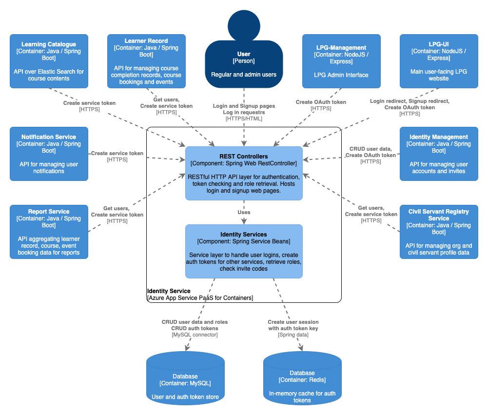

# Identity Service  
## Purpose
The Identity Service uses [Spring Security OAuth](http://projects.spring.io/spring-security-oauth/) and [Spring Security JWT](http://projects.spring.io/spring-security-jwt/) to create and validate authentication tokens. We are using with custom Details, Providers and Services in this implementation.


## Component overview



See the `diagram/` folder for diagram source in draw.io XML format


## API documentation

The [SpringDoc](https://springdoc.org/) library has been added to Identity Service to enable automatic generation of API documentation for HTTP endpoints. This will generate API docs for the classes annotated with `@RestController` and any endpoints in a `@Controller` class that have a `@ResponseBody` defined. The endpoints used by Identity Service to return HTML template responses (i.e. the paths corresponding to the web pages rather than the service APIs) will not by default be included, ensuring the API documentation shows the service interface endpoints. Further detail for each API endpoint can be included in the generated documentation by enriching the controller methods with additional annotations described in the SpringDoc documentation.

To view the Swagger UI page for a user-friendly view of the API docs, run the service locally with the configuration property `springdoc.api-docs.enabled` set to `true` and view on `localhost:8080/swagger-ui.html`. The default value is set to `false` as a production-safe value, though per-environment configuration can be created in the Terraform deployment configuration for this application to override this in a pre-production environment where exposing the Swagger UI may be desired.


## Dependencies

### Build-time

For a complete list of build dependencies check the `build.gradle` file. The main source dependencies are:  
- Spring Boot (web, redis) 2.0 
- Spring Data JPA 2.0
- Spring Security OAuth2 2.3
- Spring Security JWT 1.1
- Spring Security (core, web, config) 5.1
- Azure App Insights 2.5
- GOV.UK Notify client 3.9
- Mysql connector 8.0
- h2 database 1.4
- Flyway 5.0

### Test-time

For a complete list of test dependencies check the `pom.xml` file. The main test dependencies are:  
- Spring Boot Starter Test
- Spring Security Test
- mockito 2.8
- powermock 1.7

### Runtime 

#### Other LPG Services

- none

#### External integrations

- GOV.UK Notify for sending invite, account reset, password update reminder notifications to users

#### Data Stores

- MySQL for the identity (account), role, invite code and authentication token data
- Redis for the creating user session data keyed on auth token

#### Data migrations

The identity service application uses Flyway to manage the DB migrations inside its own schema. See the `src/main/resources/db/migration` folder. Note: in-memory H2 DB has a separate migration folder than the deployed target MySQL DB - changes must be made to both in order to run successfully when deployed to the real environments.


## Build, run, test, deploy

The application requires Java 8 (OpenJDK 8) installed to build and run.

Build the application using Gradle `./gradlew build`.

Run the project with `./gradlew bootRun` or import the project into your IDE of choice such as IntelliJ or VS Code use the IDE commands to Run Application.

Run the unit tests using `./gradlew test` or choose individual test classes or packages using your IDE.

The application is packaged as a docker container image and includes an Azure App Insights Java agent for collecting metrics from the app - see `Dockerfile` in the root directory for the container definition. `hammer` is the log collector used for aggregating log output.

The application also inclues a `Jenkinsfile` to define the Jenkins build pipeline stages and linking it to the docker image repository and correct terraform module.

Deployment is controlled via the Terraform scripts in the main PaaS repository, with per-environment configuration values referenced there and secrets injected from keybase.
 

## Usage

The application has two interfaces, a user interface for standard login to LPG, and a management for admin tasks. When the application runs on localhost, these components will run on individual ports:
e.g.  
* OAUTH2 - `localhost:8080/oauth/*`  
* MANAGEMENT - `localhost:8081/management/login`

### Using the application
The user can log in to the management portal to perform CRUD operations on Roles, Identities as well as Inviting new users.

With the standard user interface, this can be used for logging in and resetting a password.

### Requesting an access token

`https://{SERVER_URL}:{SERVER_PORT}/oauth/authorize?response_type=token&client_id={CLIENT_ID}&redirect_uri={SERVICE_URI}`

This will redirect you to a login page which will, on successful authentication direct you back to your service with a token.

### Retrieving identity information from an access token

```
curl -X GET \
  https://{SERVER URL:SERVER PORT}/identity?access_token={accessToken} \
  -H 'Cache-Control: no-cache' \
```

Will respond like

```
{
    "username": "user@domain.com",
    "uid": "3c706a70-3fff-4e7b-ae7f-102c1d46f569",
    "roles": [
        "USER"
    ]
}
```

## Configuration

Significant configuration properties are highlighted here. For the full configuration file see `src/main/resources/application.yml`

- `invite` invite signup path, validity and **domain whitelist**
- `govNotify` GOV.UK Notify API key and template references
- `accountValidation` password complexity regex
- `account` configuration for max login attempts before account lockout
- `accessToken` the JWT key used to encrypt session tokens and the time of maximum validity for user sessions
- `lpg` links back to LPG-UI for notifications and redirects
- `spring.flyway` Spring Boot configuration including flyway db migrations path
- `spring.datasource` connection parameters for MySQL DB
- `spring.redis` connection parameters for Redis session cache

# Mocks for testing Agency Self Sign Up flows
In order to test signing up users with an agency token, a fake invite service is required.
There is a spring profile which runs mock implementations for the following 3 services.
* InviteService
* NotifyService
* IdentityService

The spring profile is called runMocks and can be added to the runtime configuration.

* Invite Service was mocked to avoid the sending of a real invite.  This would require a real email account.  Most people only have 1 or 2 email accounts.
* Notify Service was mocked to avoid sending a real email via the Gov Notify service.  
* Identity Service was mocked to avoid the saving of a signed up user account to the real database.

## Running a specific spring profile via IntelliJ
Create a new runtime configuration and give it a name

set the following:
* gradle project: identity-service
* tasks: bootRun
* environment variables: SPRING_PROFILES_ACTIVE=runMocks

## Running a specific spring profile via the command line
Use the following command

SPRING_PROFILES_ACTIVE=runMocks ./gradlew clean bootRun

### Using the mocks
The create a new account screen flow sends an invitation to the relevant email account.
All this really is, is the following url.
http://localhost:8080/signup/16digitcode
For example http://localhost:8080/signup/1234567812345678

The sign up code checks the email that is returned therefore several accounts have been added to the code
in order ot mock this.

If the following url is used
http://localhost:8080/signup/joebloggsatpeo16
then the email address that is returned is joebloggs@peoplemakeglasgow.scot

The following codes can be used for the given emails as detailed in the code snippet below:
```
mockedUsers.put("joebloggsatpeo16", "joebloggs@peoplemakeglasgow.scot");
mockedUsers.put("joebloggsatnhs16", "joebloggs@nhsglasgow.gov.uk");
mockedUsers.put("joebloggsatgla16", "joebloggs@glasgownhs.gov.uk");
```

This allows you to test the agency self sign up screens.

       
## Licenses

Identity Service is licensed by the MIT license, see `LICENSE` in the root folder for details. Dependent applications are licensed as according to their respective readme and license files.

